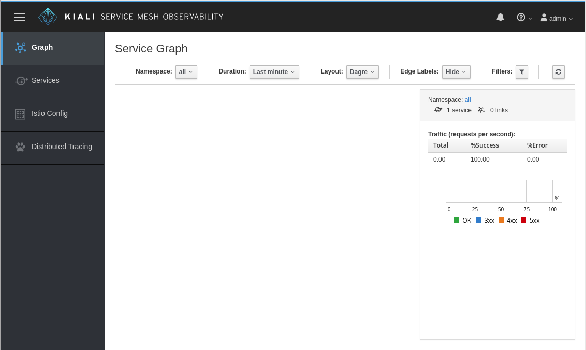

## Install Kiali

Note: OpenShift, Istio and its Prometheus and Grafana addons are being installed in your environment as you read this.
Jaeger, a distributed tracing solution is also getting deployed.

Now we need to install [`Kiali`](http://www.kiali.org)
In this case we're going to install from the "master" branch, this could break but we can't get the latest and greatest without some risks.

As a consequence, what you will see may differ from the screenshots of the tutorial

`curl -k https://raw.githubusercontent.com/kiali/kiali/master/deploy/openshift/kiali-configmap.yaml | \
   VERSION_LABEL=master envsubst | oc create -n istio-system -f -`{{execute T1}}

`curl -k https://raw.githubusercontent.com/kiali/kiali/master/deploy/openshift/kiali.yaml | \
   IMAGE_NAME=kiali/kiali \
   IMAGE_VERSION=latest \
   NAMESPACE=istio-system \
   VERSION_LABEL=master \
   VERBOSE_MODE=4 envsubst | oc create -n istio-system -f -`{{execute T1}}

You need to give it some time to fetch images and install. You can check the progress in the OpenShift UI or with the following command.
`oc get pods -n istio-system`{{execute T1}}

It should show something like this:
`$ oc get pods -n istio-system
NAME                             READY     STATUS    RESTARTS   AGE
grafana-274859801-tmrr5          1/1       Running   0          3m
istio-ca-2267585963-q2mws        1/1       Running   0          3m
istio-ingress-3271581819-k5vfc   1/1       Running   0          3m
istio-mixer-3525126435-vhh8k     3/3       Running   0          3m
istio-pilot-1128596656-j8jc6     2/2       Running   0          3m
kiali-3672070009-c599v           1/1       Running   0          3m
prometheus-3936029847-ljkm6      1/1       Running   0          3m`

But after a few minutes, the Kiali console should be available at:
http://kiali-istio-system.[[HOST_SUBDOMAIN]]-80-[[KATACODA_HOST]].environments.katacoda.com

 `Username: admin`
 `Password: admin`

