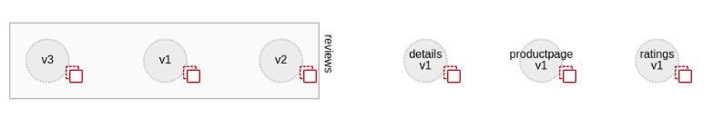
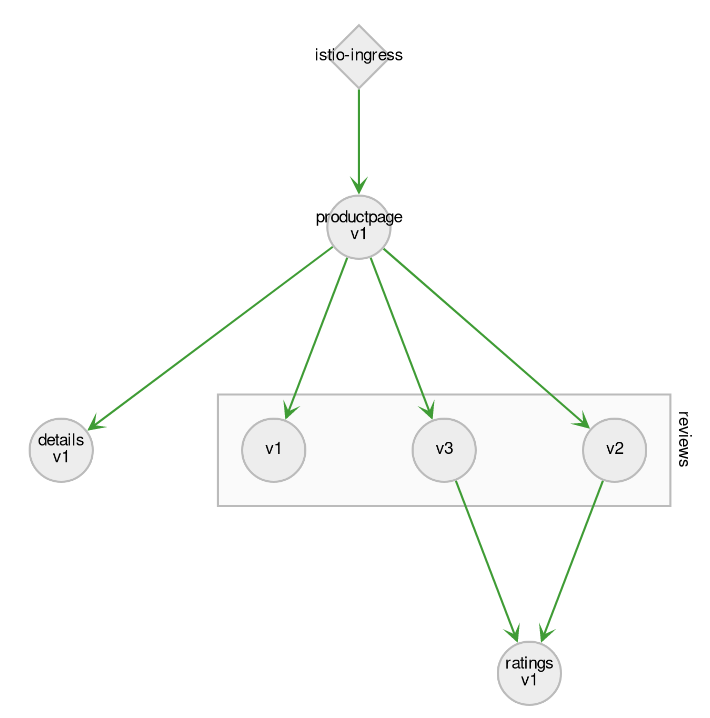

## Installing the Bookinfo Istio tutorial

As we will follow the Istio tutorial, we need to install the sample application named: Bookinfo

Bookinfo is an application made of multiple services, some having multiple versions with different features

First let's create a namespace for it:
`oc create namespace bookinfo`{{execute T1}}

And give permissions in that namespace:
`oc adm policy add-scc-to-user privileged -z default -n bookinfo`{{execute T1}}

Finally, let's deploy the application, and let Istio add the sidecars to the tutorial demo:
`istioctl kube-inject -f /root/installation/istio-0.7.1/samples/bookinfo/kube/bookinfo.yaml | oc apply -n bookinfo -f -`{{execute T1}}

You can verify the creation of the services with the command:
`oc get services -n bookinfo`{{execute T1}}

It should show something like:
`$ oc get -n bookinfo services
NAME          CLUSTER-IP       EXTERNAL-IP   PORT(S)    AGE
details       172.30.19.234    <none>        9080/TCP   3s
productpage   172.30.181.57    <none>        9080/TCP   2s
ratings       172.30.168.101   <none>        9080/TCP   3s
reviews       172.30.239.112   <none>        9080/TCP   3s`

And verify that the pods are deployed correctly:
`oc get pods -n bookinfo`{{execute T1}}

After some time (execute the command multiple times if necessary to see the updated status), it should show all pods as 'Running':
`$ oc get pods -n bookinfo
NAME                              READY     STATUS    RESTARTS   AGE
details-v1-3618568057-gx75n       2/2       Running   0          2m
productpage-v1-2306626373-thbg5   2/2       Running   0          2m
ratings-v1-2217417509-hbs9g       2/2       Running   0          2m
reviews-v1-3758685241-g784w       2/2       Running   0          2m
reviews-v2-29632839-vlgt8         2/2       Running   0          2m
reviews-v3-2285656649-nxz4j       2/2       Running   0          2m`

You can verify in Kiali that the 4 services have been deployed.

Go to:
http://kiali-istio-system.[[HOST_SUBDOMAIN]]-80-[[KATACODA_HOST]].environments.katacoda.com/console/service-graph/bookinfo?layout=dagre&duration=60&edges=hide

And you should see the 4 services like this:

Now, we can create a first request on the newly deployed sample, it will let Kiali know about the interactions between services:
http://istio-ingress-istio-system.[[HOST_SUBDOMAIN]]-80-[[KATACODA_HOST]].environments.katacoda.com/productpage

Refresh the page multiple times, you should see the 3 versions of the 'reviews' service called as you refresh, one version without rating, one with rating stars in black and
one with rating stars in red.

Now go back to Kiali
http://kiali-istio-system.[[HOST_SUBDOMAIN]]-80-[[KATACODA_HOST]].environments.katacoda.com/console/service-graph/bookinfo?layout=dagre&duration=60&edges=hide

You should see a nicer graph showing the routes:

At this point you successfully have a working installation with:
 * Openshift
 * Istio
 * Kiali
 * Bookinfo tutorial

We're good to start the real fun now !
Next we'll change Istio rules and watch the impact in Kiali.
