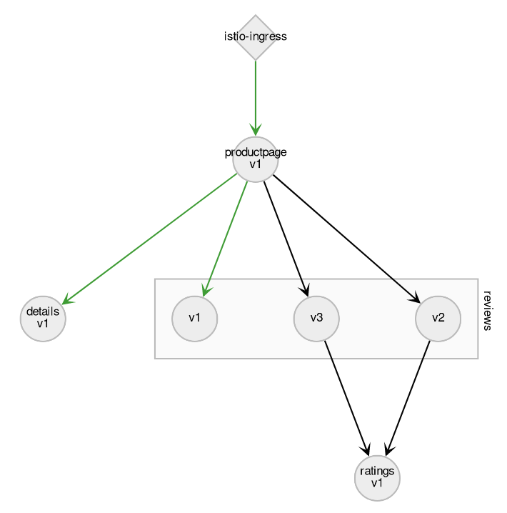
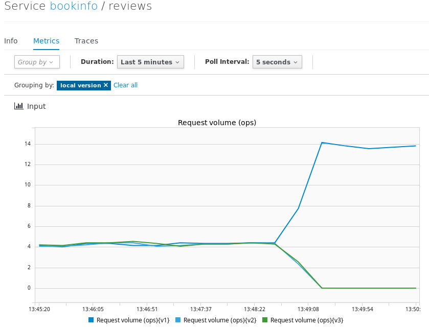
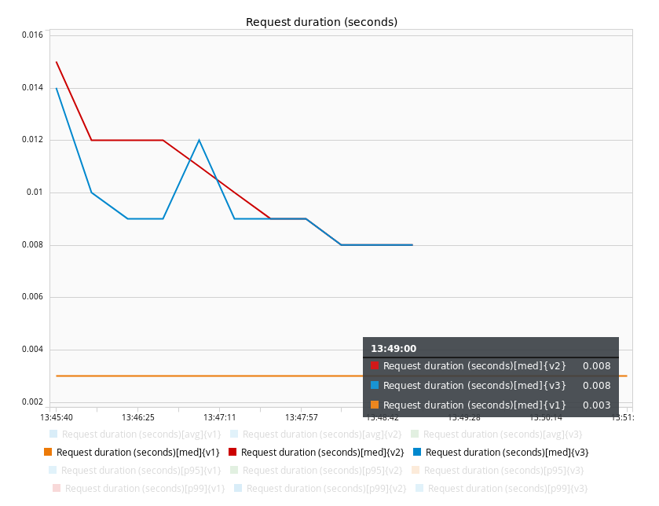

## Add request routing
By default, requests are randomly sent to any of the three versions of the 'review' service.

Let's generate some requests to have some data to look at:
`while true; do curl -o /dev/null -s -w "%{http_code}\n" http://istio-ingress-istio-system.[[HOST_SUBDOMAIN]]-80-[[KATACODA_HOST]].environments.katacoda.com/productpage; done`{{execute T2}}

If you look at Kiali console, you should see traffic going to any of the three versions of the 'review' service.
http://kiali-istio-system.[[HOST_SUBDOMAIN]]-80-[[KATACODA_HOST]].environments.katacoda.com

Now, we'll instruct Istio to send all the request to v1, and we'll verify this in Kiali afterward.

`istioctl create -f /root/installation/istio-0.7.1/samples/bookinfo/routing/route-rule-all-v1.yaml`{{execute T1}}

In Kiali console, change the duration to "Last Minute", and after a minute, you should see all the traffic going to v1.

Now click on the 'reviews' box and click the link "View detailed charts >>" then the "Metrics" tab.

You can see there the requests being equally distributed across versions and then all sent to v1.

Just under, you can also compare the response times, obviously v1 was faster since it doesn't call the 'ratings' service, is the new response time acceptable ?

You probably won't want to send all the traffic to v2 before verifying what the response time will be. Let's redirect the authenticated user 'jason' to v2, but before that, let's remove the other routes:
`istioctl replace -f /root/installation/istio-0.7.1/samples/bookinfo/routing/route-rule-reviews-test-v2.yaml`{{execute T1}}

And let's authenticate as 'jason' (any password) and make a few refresh in our web browser:
http://istio-ingress-istio-system.[[HOST_SUBDOMAIN]]-80-[[KATACODA_HOST]].environments.katacoda.com/productpage
